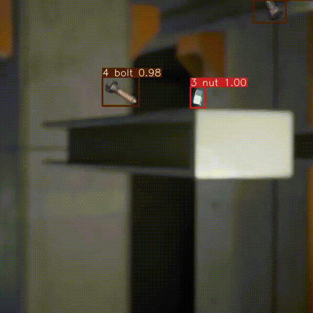

# Bolts and Nuts Tracking Project
Nesne tespiti ve takibi çalışması.



Daha detaylı anlatım ve kullanım için object_tracking_nuts_and_bolts.ipynb dosyasını çalıştırın

ya da

## Hızlı inceleme:

```
pip install -r requirements.txt
```
Strong Sort'u indirin:
```
git clone https://github.com/mikel-brostrom/Yolov7_StrongSORT_OSNet.git
```
```
cd Yolov7_StrongSORT_OSNet
```
İçerisine Yolov7 modelini ekleyin:

- Yolo ve reid ağırlıklarını girin
- Eşik ve görüntü kaynağını ayarlayın
```
python track.py --source val.mp4 --yolo-weights .runs/train/custom_train/weights/best.pt --strong-sort-weights resnet50_fc512_msmt17.pt --img 640 --conf-thres 0.85 --iou-thres 0.70
```
Onnx ile kullanmak için:

Resnet50 linki:
https://download.pytorch.org/models/resnet50-19c8e357.pth

```
python reid_export.py --weights {reid_weight} --dynamic --img-size 640 640
```

## DeepStream İle Çalıştırma
```
!git clone https://github.com/marcoslucianops/DeepStream-Yolo.git
```
```
cd DeepStream-Yolo
```
Repo içerisinde verilen DeepStream-Yolo içindeki dosyaları ve ağırlıkları indirilenler ile değiştirin
```
deepstream-app -c deepstream_app_config.txt
```

Örnek çalışma:
```
@Article{s22145184,
AUTHOR = {Sun, Yuhang and Li, Mengxuan and Dong, Ruiwen and Chen, Weiyu and Jiang, Dong},
TITLE = {Vision-Based Detection of Bolt Loosening Using YOLOv5},
JOURNAL = {Sensors},
VOLUME = {22},
YEAR = {2022},
NUMBER = {14},
ARTICLE-NUMBER = {5184},
URL = {https://www.mdpi.com/1424-8220/22/14/5184},
PubMedID = {35890864},
ISSN = {1424-8220},
ABSTRACT = {Bolted connections have been widely applied in engineering structures, loosening will happen when bolted connections are subjected to continuous cyclic load, and a significant rotation between the nut and the bolt can be observed. Combining deep learning with machine vision, a bolt loosening detection method based on the fifth version of You Only Look Once (YOLOv5) is proposed, and the rotation of the nut is identified to detect the bolt loosening. Two different circular markers are added to the bolt and the nut separately, and then YOLOv5 is used to identify the circular markers, and the rotation angle of the nut against the bolt is calculated according to the center coordinate of each predicted box. A bolted connection structure is adopted to illustrate the effectiveness of the method. First, 200 images containing bolts and circular markers are collected to make the dataset, which is divided into a training set, verification set and test set. Second, YOLOv5 is used to train the model; the precision rate and recall rate are respectively 99.8% and 100%. Finally, the robustness of the proposed method in different shooting environments is verified by changing the shooting distance, shooting angle and light condition. When using this method to detect the bolt loosening angle, the minimum identifiable angle is 1&deg;, and the maximum detection error is 5.91% when the camera is tilted 45&deg;. The experimental results show that the proposed method can detect the loosening angle of the bolted connection with high accuracy; especially, the tiny angle of bolt loosening can be identified. Even under some difficult shooting conditions, the method still works. The early stage of bolt loosening can be detected by measuring the rotation angle of the nut against the bolt.},
DOI = {10.3390/s22145184}
}
```
